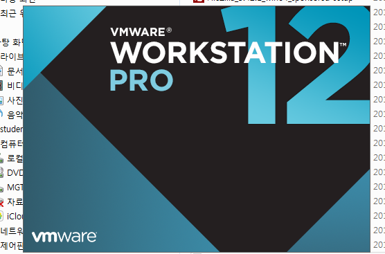

# 가상머신이란

가상머신이란 가상의 컴퓨터로 존재하는 것이며 가상머신에 os를 설치 할 수 있다. 이 OS를 게스트 OS라 하고 원래 컴퓨터의 운영체제를 호스트 OS라 한다.

# VMWARE

### 가상머신 설치

PRO가 유료이므로 아래의 버전을 설치한다.

1)  vmware 다운로드 - [https://my.vmware.com/web/vmware/details?downloadGroup=WKST-1259-WIN&productId=524&rPId=20840#product_downloads]    12.1.1 버전을 설치한다. pro로 설치한다. pro를 설치하면 스냅숏 기능과 가상 네트워크 사용자 설정 기능을 사용할 수 있다. 
2)  vmware 키 다운로드 - <https://dd00oo.tistory.com/entry/VMWare-12-key>  해당 키 목록 중에 하나를 선택해서 등록한다.

### 64bit 및 가상화 기술 지원 여부 확인

자신의 피씨가 가상화 기술을 지원하는지 확인하려면 아래의 링크로 들어가서 설치한다.

http://www.grc.com/secureable.html   또는  http://cafe.naver.com/thisisLinux/  

securable 프로그램을 다운받고 실행하였을 때 나오는 이미지에  Maximum Bit Length,  Hardware D.E.P ,  Hardware Virtualization 에서 각각 64, yes, yes가 나와야 정상이다. 

만약 이미지가 나오지 않는다면  BIOS에서 '가상화 기술' 기능이 껴져 있는지 확인한다. 가상화 기술 확인하 방법은 제조사마다 다르므로 알아서 확인한다.

### VMware 설치진행 과정 

1. 다운받은 VMware 파일을 실행하면 아래와 같은 화면을 처음 만난다.

2. 위 화면이 지나고 나면 [End-User License Agreement] 대화창이 나온다. 가볍게  I accept the terms~~~ 를 체크하여주고 \<NEXT\> 버튼을 눌러준다.

   

   

3. [Custom Setup] 대화창에서는 VMware 의 설치 폴더를 지정한다. 일부러 바꿀 필요는 없으므로 기본을 사용한다. 

   아래의 옵션 [ Enhanced Driver~~~ ]는 키보드 입력을 좀더 안정적으로 추가할 수 있고 보완적으로 강화된 기능이 들어가며 만약 이 옵션을 체크하면 컴퓨터를 재부팅해야 한다고 한다.  

   개인이 사용할 때는 아무쓸모가 없으므로 이 이 옵션을 선택하지 않는다. \<NEXT\> 버튼을 클릭한다.

   

   

4. [User Experience Settings]에서는 모든 옵션을 체크한다.  vmware update와 개선에 관한 옵션이므로 무시하고 [NEXT] 버튼을 클릭한다. 

   

   

5. [Shortcuts]는 디폴트로 두고 \<Next\> 버튼을 클릭한다.

   

6. 이제 Install을 설치하면 설치가 진행되고 완료된 후 Finish를 클릭한다.

7. 설치된 vmware를 실행하면  시리얼 키와 try 버전을 선택하는 대화창이 뜬다. 

   시리얼 키는 위에서 제공한 링크로 이동하여 원하는 키를 찾아 입력하여 준다.

### 가상머신 생성

`New Virtual Machine Wizard` 를 실행하면 대화창이 나오며 `typical`과 `custom` 두 개의 선택사항을 제공한다. 

`typical`은 쉽고 빠르게 가상머신을 만들 수 있도록 제공하고 `custom`은 사용자가 세부사항을 제공하면 만들수 있도록 한다.

#### custom 선택시

##### 1. Choose The Virtual Machine Hardware  .....

이 대화창은 가상머신 하드웨어의 호환성 버전을 선택을 제공한다. 

최상위 버전을 선택하고 `next` 버튼을 클릭한다. 

   

   

   

##### 2. Guest Operating System Installation

운영체제 설치파일을 선택하는  대화창이다.  아직 install 파일 또는 디바이스가 없으므로 마지막 옵션을 선택한다.

   

   ​	

##### 3. Select a Guest Operating System

가상머신의 게스트 운영체제를 선택하는 대화창이다. Linux의 ubuntu를 선택하여 준다. 

##### 4. Name The Virtual Machine

가상머신의 이름과 저장 경로를 지정해 준다.

 

##### 5. Processor Configuration

가상머신의 프로세스 수를 지정한다. 많으면 많을수록 게스트의 처리 속도가 빨라진다. 

##### 6. Memory for the Virtual Machine

가상머신의 메모리 용량을 설정한다. 2GB 로 설정해준다.

##### 7. Network Type

네트워크의 유형을 선택하는 것이다. 

- Use bridged networking 

  호스트의 네트워크와 게스트의 네트워크를 브릿지하여(연결하여) 게스트 컴퓨터가 네트워킹 하는 방식입니다. 즉, 호스트와 게스트를 하나로 연결하여 두 개의 네트워크를 마치 하나의 네트워크처럼 쓰는 것 입니다.

- Use network address translation (NAT)

  NAT 방식은 

- Use host noly networking 

  

